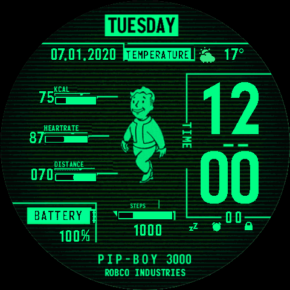

# Pip-Boy 3000 — Amazfit Balance 2 Watch Face

A Fallout-style **Pip-Boy 3000** watch face for the **Amazfit Balance 2** (480×480 round
display), built as a native ZeppOS app. Bright phosphor-green UI on a dark CRT-scanline
background, with Russian labels (ВРЕМЯ, ВТОРНИК, ККАЛ, ПУЛЬС, РАССТОЯНИЕ, ШАГИ, БАТАРЕЯ,
ТЕМПЕРАТУРА) and an animated Vault Boy.

> **Language: Russian only (for now).** All on-screen labels and the weekday names are baked
> into the image assets (`0000.png` background + the weekday sprites) in Russian — there is no
> locale/i18n switch yet. Other languages would require redrawn assets (see
> [docs/ASSETS.md](docs/ASSETS.md)).

<p align="center">
  
</p>

## Features

- **Time** — large hour-over-minute digits plus small seconds, all one autonomous `IMG_TIME`.
- **Date** — `DD.MM.YYYY`, drawn per-digit from the time sensor and snugged to the
  background's separator dots.
- **Day of week** — top banner (ВТОРНИК, etc.).
- **Animated Vault Boy** — 8-frame walk cycle (≈200 ms/frame).
- **Activity gauges** — Calories / Pulse / Distance / Steps are sensor-driven: each bar always
  shows its green frame and fills by value toward its goal (accurate even at near-zero morning
  data — see [docs/ZEPPOS-FINDINGS.md](docs/ZEPPOS-FINDINGS.md) #2).
- **Battery** — `NN%` with the `%` glyph kept inside its box.
- **Weather** — icon + temperature.
- **Status icons** — Bluetooth / alarm / lock.
- **Tap-to-launch shortcuts** — tapping a field opens its app: Calories / Distance / Steps →
  Activity, Pulse → Heart Rate, Weather → Weather, Date → Calendar, Time → Alarm, **Battery →
  battery page**.

## Project layout

This is a standard **Zeus** (ZeppOS CLI) source project. Assets live under a per-target
subfolder (`assets/<target>/`); `app.json` declares the build targets and Zeus compiles the
project into the device package.

```
.
├── app.json                     # Zeus manifest (configVersion v3): targets.balance2, designWidth 480
├── app.js                       # modern App({}) entry boilerplate
├── watchface/
│   └── index.js                 # the watch face, as @zos source: WatchFace({ build, onDestroy })
├── assets/
│   └── balance2/                # per-target asset folder (matches the target name in app.json)
│       ├── 0000.png …           # background, glyph fonts, Vault Boy frames, gauge sprites (PNG)
│       ├── Preview.png          # app cover (plain PNG — Zeus generates the device TGA at build)
│       ├── transparent.png
│       └── fonts/2Expansiva-bold.ttf
├── preview.js                   # zero-dep Node previewer (runs the face under mocked @zos)
├── preview.gif                  # animated preview (Vault Boy walk) — README hero
├── preview.png                  # static rendered preview
├── docs/                        # architecture, ZeppOS findings, asset map
├── .gitignore                   # ignores build output (dist/, .zeus/, *.zab/.zpk, node_modules/)
└── README.md
```

`appId` is `1742985`, `appName` is `PipBoy3000`, `configVersion: v3`, target API **`4.0.0`**
(Balance 2 supports up to API 4.2). Target device codes: `Lyon` / `LyonWN` / `LyonW`
(deviceSource 9568512/13/15).

## Build / package

Build with the [Zeus CLI](https://docs.zepp.com/docs/guides/tools/cli/) (v1.9.x):

```bash
zeus build        # → dist/<appId>-PipBoy3000-<version>-<timestamp>.zab
zeus preview      # live preview (needs the simulator / a paired device)
```

`zeus build` runs the full native toolchain: it bundles the `@zos` source (ROLLUP), **compiles
it to QuickJS bytecode** (`index.bin`), and **converts every PNG asset to the native ZeppOS TGA
format** — then packs everything into a `.zab` (which wraps the device `.zpk`). No login is
needed for a local build. The `dist/` output is gitignored.

> `watchface/index.js` is modern `@zos` source (`import * as hmUI from '@zos/ui'`, `WatchFace({…})`);
> Zeus adds its own runtime wrapper at build. An earlier attempt that fed Zeus the
> *editor-exported, pre-wrapped* JS at API 3.0 installed but showed a **black screen** — see
> finding #11 in [docs/ZEPPOS-FINDINGS.md](docs/ZEPPOS-FINDINGS.md).

## Preview (before flashing)

```bash
node preview.js                  # → preview.png (static)
node preview.js preview.gif      # → animated GIF (Vault Boy walk cycle, 8 frames @ 200 ms)
node preview.js out.gif 16       # optional 2nd arg = frame count
```

A **zero-dependency** Node script (built-in `zlib` only). It runs `watchface/index.js` under
mocked `@zos` modules, captures the actual `createWidget(...)` calls, and composites the PNG
assets to a 480×480 image with mock data — so the layout can be checked with no watch. A `.gif`
output renders multiple frames (advancing the animation timers) and encodes an animated GIF
(hand-rolled GIF89a + LZW, still zero-dep). It's an approximation (mock data, no live sensors);
for a true device/simulator preview use `zeus preview`.

## Quick check on your watch (fastest)

The quickest loop — no manual sideloading — is **Developer Mode + a `zeus preview` QR**:

1. **Enable Developer Mode** in the Zepp app: **Profile → Settings → Information**, then **tap the
   logo** there a few times until Developer Mode unlocks.
2. In the project root run **`zeus preview`** — a **QR code** is printed in the terminal.
3. In the Zepp app's **Developer Mode**, tap the **Scan** icon and scan that QR — the watch face
   compiles and loads straight onto your connected Balance 2.

(`zeus preview` builds for the real device; you must be signed into the same Zepp account as the
watch.)

## Install (permanent)

To keep the face on the watch, sideload the built `.zab` (or the inner `.zpk`) — via the Zepp app
(Profile → your watch → Watch faces → add a custom face) or the developer bridge. Bump
`app.json` `version` on each rebuild, or the watch may keep the old copy (see
[docs/ZEPPOS-FINDINGS.md](docs/ZEPPOS-FINDINGS.md) #2).

## Documentation

- **[docs/ARCHITECTURE.md](docs/ARCHITECTURE.md)** — file roles, the `WatchFace({ build,
  onDestroy })` lifecycle, `data_type` auto-binding vs the two timers (date + Vault Boy), and a
  full widget inventory (type, binding, asset, coordinates).
- **[docs/ZEPPOS-FINDINGS.md](docs/ZEPPOS-FINDINGS.md)** — reusable Balance 2 / ZeppOS lessons
  (symptom → cause → fix): `TEXT_IMG` alignment needs `w`; `IMG_LEVEL` `type`-binding limits and
  why gauges are driven as plain `IMG` + `setProperty(SRC)` instead; the TGA cover requirement;
  the unique-`appId` rule; the version-bump-to-reinstall gotcha; building with `zeus`; tap
  shortcuts via `launchApp` / `IMG_CLICK`; and why an editor-exported face rebuilt by Zeus
  black-screens (the `@zos`-source fix).
- **[docs/ASSETS.md](docs/ASSETS.md)** — the numbered-PNG asset index map.

## Known on-watch behaviors

- **Gauges are sensor-driven.** Each bar (Calories/Pulse/Distance/Steps) is a plain `IMG` whose
  fill sprite is chosen in `updateGauges()` from `@zos/sensor` (the same data the numbers show):
  Cal/Steps `current/getTarget()`, Distance `current / ~10 km`, Pulse over `[40,180]`. The green
  frame is always drawn (level 0 = empty frame — never a black box). The full-scale goals
  (`DIST_FULL_M`, `HR_MIN`/`HR_MAX`, `CAL_GOAL`/`STEP_GOAL` fallbacks) are tunable in
  `watchface/index.js`. Needs the `data:user.hd.{step,calorie,distance,heart_rate}` permissions.
- **Temperature & distance units** (°C/°F, km/mi, decimal point) follow the watch's
  locale/unit settings.
- The **date** is drawn per-digit and refreshed from the `Time` sensor (kept per-digit so the
  digits stay pixel-aligned to the baked separator dots). AM/PM is not shown; `IMG_TIME` follows
  the watch's 12/24-hour setting.

## Credits

Based on the GTR Pip-Boy 3000 watch face
([amazfitwatchfaces.com/gtr/view/3513](https://amazfitwatchfaces.com/gtr/view/3513)),
converted and adapted to the Amazfit Balance 2 / ZeppOS platform.
