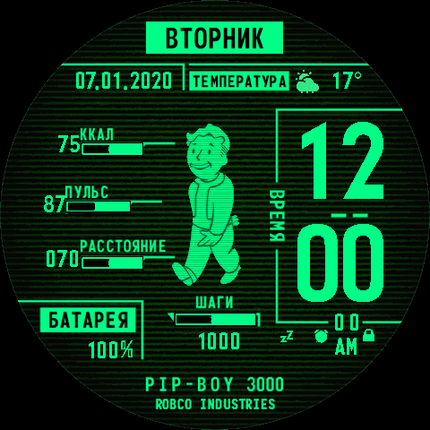

# Pip-Boy 3000 — Amazfit Balance 2 Watch Face

A Fallout-style **Pip-Boy 3000** watch face for the **Amazfit Balance 2** (480×480 round
display), built as a native ZeppOS app. Bright phosphor-green UI on a dark CRT-scanline
background, with Russian labels (ВРЕМЯ, ВТОРНИК, ККАЛ, ПУЛЬС, РАССТОЯНИЕ, ШАГИ, БАТАРЕЯ,
ТЕМПЕРАТУРА) and an animated Vault Boy.



## Features

- **Time** — large hour-over-minute digits, plus a sensor-driven seconds readout.
- **Date** — `DD.MM.YYYY`, drawn per-digit from the time sensor and snugged to the
  background's separator dots.
- **Day of week** — top banner (ВТОРНИК, etc.).
- **Animated Vault Boy** — 8-frame walk cycle (≈200 ms/frame).
- **Activity gauges** — Calories / Pulse / Steps fill by value (`IMG_LEVEL` bound to the
  `CAL` / `HEART` / `STEP` data types).
- **Battery** — `NN%` with the `%` glyph kept inside its box.
- **Weather** — icon + temperature.
- **Status icons** — Bluetooth / alarm / lock.

## Project layout

```
.
├── app.json            # ZeppOS app manifest (watchface module, Balance 2 targets)
├── app.js              # app entry boilerplate
├── watchface/
│   └── index.js        # all watch-face logic (widgets, sensors, timers)
├── assets/
│   ├── 0000.png …      # background, glyph fonts, Vault Boy frames, gauge sprites
│   ├── Preview.png     # app cover (ZeppOS TGA format, .png extension)
│   ├── transparent.png
│   └── fonts/2Expansiva-bold.ttf
├── preview.png         # rendered preview for this README
├── .gitignore
└── README.md
```

`appId` is `1742985`, `appName` is `PipBoy3000`, target API `1.0.0`–`1.0.1`.

## Build / package

This is a standard ZeppOS watch-face project. With the [Zeus CLI](https://docs.zepp.com/docs/guides/tools/cli/):

```bash
zeus preview      # live preview in the simulator
zeus build        # produce the installable package
```

If you don't use Zeus, the package is just a zip of the project root — that is exactly how
the existing `.zip` was produced:

```bash
zip -r PipBoy3000.zip app.json app.js watchface assets
```

(`.zab` and `.zpk` are byte-identical copies of that zip, renamed.)

## Install

Sideload the produced archive onto the Balance 2 — via the Zepp app (Profile → your watch →
Watch faces → add a custom face) or the developer bridge, the same way any custom face is
installed.

## Known on-watch behaviors

- **Distance gauge stays empty.** ZeppOS `DISTANCE` has no `_TARGET` and a `[0,99] km` range,
  so it can't be `type`-bound like a goal metric. It's bound to `type:STEP` so it renders
  without error, but two `IMG_LEVEL` widgets can't share one data type — only the Steps gauge
  actually fills. (A crash-safe dynamic version would compute the level from the distance
  sensor inside the resume/timer callback, wrapped in try/catch — never via a sensor listener
  in `init_view()`, which aborts the whole face.)
- **Temperature & distance units** (°C/°F, km/mi, decimal point) follow the watch's
  locale/unit settings.
- **AM/PM** shows only when the watch is in 12-hour mode; it's hidden in 24-hour mode.
- The **date** is sensor-driven per digit (the native `IMG_DATE` widget did not render on the
  Balance 2).

## Credits

Converted from the GTR Pip-Boy 3000 watch face and adapted to the Amazfit Balance 2 / ZeppOS
platform.
